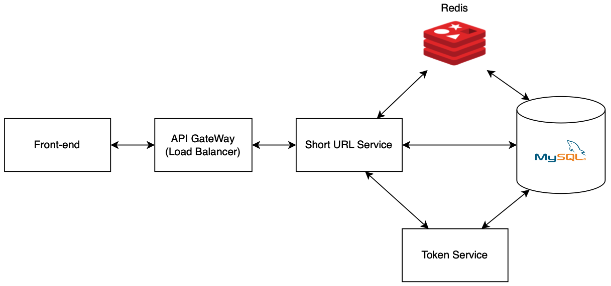

# Tiny-URL System
A personal project made to practice system design.

## Features
* Short URL generation and redirection service
* User registration and login with JWT authentication
* User URL allowance and management
* Custom URL path
* Private URL service

## Technologies
* Spring Boot 3.0.2
* Spring Cloud 2022.0.1
* Spring Security
* JSON Web Tokens (JWT)
* Maven

## Design
* For system design specifications, please refer to the [design documentation](https://github.com/dlim2012/tiny-url-system-design/blob/main/Design%20doc.pdf).

<p align="center">
  
</p>

## To build and run this project
```bash
git clone https://github.com/dlim2012/tiny-url-system-design.git
cd tiny-url-system-design

# Run databases and Zipkin: MySQL (port 3306), Cassandra (port 9042), Zipkin (port 9411)
docker compose up -d

# Build and run this project
mvn clean install
java -jar eureka-server/target/eureka-server-1.0-SNAPSHOT.jar # Run Eureka Server (port 8761)
java -jar apigw/target/apigw-1.0-SNAPSHOT.jar # Run API Gateway (port 80)
java -jar appuser/target/appuser-1.0-SNAPSHOT.jar # Run User service (port 8081)
java -jar shorturl/target/shorturl-1.0-SNAPSHOT.jar # Run Short URL service (port 8082)
java -jar token/target/token-1.0-SNAPSHOT.jar # Run Token service (port 8083)
```

